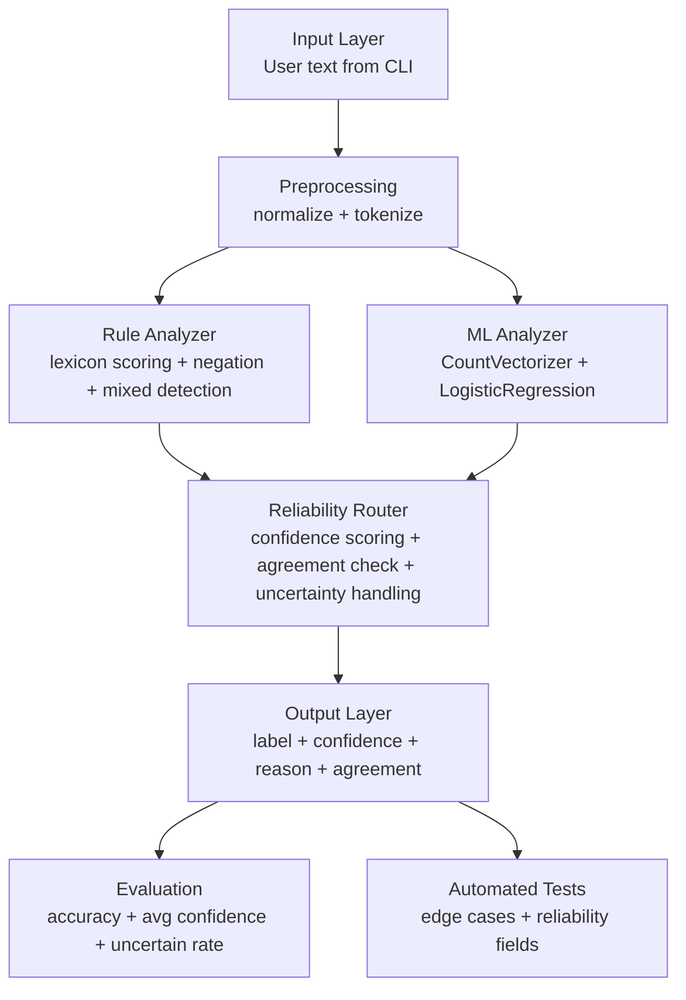

# Mood Machine Architecture

## How the AI Feature Fits
The key AI feature is the **Reliability Router**. It takes outputs from both analyzers and makes a confidence-aware final decision:
- Agreement -> return shared label with combined confidence.
- Disagreement with high confidence signal -> pick stronger signal.
- Disagreement with low confidence -> return `uncertain`.

This is integrated directly into `MoodAnalyzer.analyze()` and used by `main.py` in real execution.
